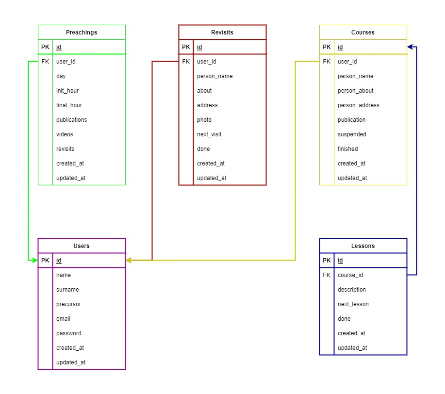

<h1 align="center">JW Reports</h1>

<br>

<p align="center">
    
</p>

<br>

Esta aplicación es para **gestionar los informes de predicación, revisitas y cursos de los Testigos de Jehová.** Muchos hermanos 
que saben desarrollar aplicaciones han hecho aplicaciones de este tipo, así que también **me he motivado a hacerlo con el fin 
de ayudar a los hermanos y mejorar mis habilidades** con React Native y usar el servicio de Supabase. Cabe aclarar que está **no 
es una aplicación oficial de Watch Tower Bible and Tract Society of Pennsylvania.**

También he decidido dejar el **código al público** para que se vea el funcionamiento de la aplicación y más hermanos que tengan
los conocimientos debidos puedan, si ellos lo quieren, **hacer su propia implementación.**

Este documento explica las tecnologías utilizadas, el entorno de desarrollo, arquitectura, la base de datos, cómo crear su implementación propia, el testing, etc.

<br>

## 1) Tecnologías

### 1.1) React Native
Es un **marco de desarrollo de aplicaciones móviles** que permite a los desarrolladores crear aplicaciones para iOS y Android 
utilizando la misma **base de código en JavaScript y React.**

**Utiliza una arquitectura de componentes,** lo que significa que las aplicaciones se construyen a partir de **componentes 
reutilizables** que se pueden combinar para crear interfaces de usuario complejas. Estos componentes se pueden personalizar con CSS 
y JavaScript, lo que permite a los desarrolladores **crear aplicaciones móviles personalizadas y únicas.**

Proporciona una **experiencia de desarrollo más rápida** al permitir a los desarrolladores **escribir una vez y ejecutar en 
múltiples plataformas.** Además, utiliza un **enfoque de renderizado nativo,** lo que significa que las aplicaciones se ejecutan 
de manera más eficiente y tienen un mejor rendimiento que las aplicaciones web empaquetadas en una vista web dentro de 
una aplicación nativa.

### 1.2) Typescript
Lenguaje de programación de **código abierto** desarrollado por Microsoft que **amplía la sintaxis de JavaScript** con la adición de 
tipos estáticos opcionales. Se puede considerar como una **capa de abstracción sobre JavaScript** que proporciona una mayor 
seguridad y escalabilidad al código.

Los desarrolladores pueden **especificar tipos de datos para variables, funciones y otros elementos del código,** lo que permite 
**detectar errores de manera más temprana** durante la fase de desarrollo. Además, TypeScript permite a los desarrolladores 
**aprovechar las características avanzadas de ECMAScript, como clases, interfaces y decoradores,** mientras proporciona una 
compatibilidad con versiones anteriores de JavaScript.

### 1.3) Supabase
Es una **alternativa de Firebase de código abierto.** Una **plataforma de bases de datos en la nube** que combina la
simplicidad y la accesibilidad de una **herramienta de gestión de bases de datos** no relacionales con la potencia y
la escalabilidad de una base de datos relacional.

Supabase es una opción popular para desarrolladores y empresas que buscan una solución de bases de datos en la nube para
sus aplicaciones y proyectos.

### 1.4) OneSignal
Es una **plataforma de mensajería y automatización de notificaciones push** para sitios web y aplicaciones móviles. Permite a
los desarrolladores y propietarios de sitios web **enviar notificaciones push personalizadas y automatizadas** a los usuarios en
tiempo real.

### 1.5) Jest
Es la **herramienta de Test más popular** y recomendada para React. Es creado por Facebook. Jest no es solo una biblioteca, es
un marco de prueba. Significa que **viene con una biblioteca de afirmaciones, un corredor de pruebas y soporte** para cosas.
Como ha sido diseñado específicamente para probar las aplicaciones React, también se puede utilizar en otros marcos de JavaScript.

### 1.6) React Native Testing Library
Nos ofrece un nuevo enfoque a más alto nivel sobre los tests, válido tanto para **unitarios como para integración** y al combinarlos
podemos conseguir una cobertura de tests con la que podemos confirmar que estamos desarrollando sobre seguro en proyectos de
cualquier tamaño.

### 1.7) Enlaces
 * [React Native](https://reactnative.dev)  
 * [TypeScript](https://www.typescriptlang.org)  
 * [Supabase](https://supabase.com)  
 * [OneSignal](https://onesignal.com)
 * [Jest](https://jestjs.io)
 * [React Native Testing Library](https://callstack.github.io/react-native-testing-library)

<br>

## 2) Entorno de desarrollo
Para montar el entorno de desarrollo y correr la aplicación se necesitan los siguientes programas:

### 2.1) Node.js
Es un **entorno en tiempo de ejecución multiplataforma para la capa del servidor** (en el lado del servidor) basado en 
JavaScript. Controlado por eventos, diseñado para crear aplicaciones escalables, permitiéndote establecer y gestionar 
múltiples conexiones al mismo tiempo. Gracias a esta característica, no tienes que preocuparte con el bloqueo de procesos, 
pues no hay bloqueos.

Node.js está **basado en el motor V8 de Google**, uno de los intérpretes de lenguaje de programación que existen. Este 
motor se encarga de compilar el código JavaScript en código de máquina, un código de nivel más bajo que no hace falta 
que sea interpretado por el navegador.

### 2.2) Yarn (opcional)
Es un **gestor dependencias de JavaScript**, que está enfocado en la velocidad y la seguridad, y a diferencia de otros gestores
como NPM, YARN es muy rápido y muy fácil de usar.

Además, **devuelve un feedback al usuario bastante amigable**, lo que hace que este sienta que realmente la propia herramienta
vela porque aprendamos a usarla y porque tengamos siempre la mejor y más clara ayuda posible.

### 2.3) Android Studio
Cuando hablamos de Android Studio, nos referimos a un **entorno de desarrollo especializado**. Evidentemente, hablamos de todo
lo que tenga que ver con el desarrollo de herramientas y aplicaciones para sistemas operativos Android.

Permite una **flexibilidad en cuanto al desarrollo de características y funciones** que puede tener una herramienta o app de
dicho sistema.

Este entorno sirve para que las **aplicaciones que se estén desarrollando sean mucho más eficientes y autosuficientes**. Esto
permite, incluso, tener compatibilidades con otros sistemas o plataformas.

### 2.4) Flipper
Flipper es una **plataforma para depurar aplicaciones iOS, Android y React Native**. Puede visualizar, inspeccionar y controlar
sus aplicaciones desde una sencilla interfaz de escritorio. Puede usar Flipper tal cual o extiéndalo usando plugin API.

### 2.5) Enlaces
 * [Node.js](https://nodejs.org)
 * [Yarn](https://yarnpkg.com)
 * [Android Studio](https://developer.android.com/studio)
 * [Flipper](https://fbflipper.com)

<br>

## 3) Arquitectura
Con **arquitectura** me refiero a las **aplicaciones que en conjunto permiten el correcto funcionamiento de JW Reports.** 
En total podemos **identificar 4 aplicaciones** para este proyecto: Aplicación Móvil, Proyecto de Supabase, Sitio Web de
verificación de correos y Servidor de Notificaciones. Cada una con un propósito. 

Al final de esta sección encontrará unos enlaces para ver el código del server y sitio web. Aquí una pequeña explicación
del propósito de cada uno de ellos:

### 3.1) Aplicación Movil
Es la aplicación con la que al final los usuarios **van a interactuar más y es la que tiene el foco principal de desarrollo.** 
Las otras aplicaciones y servicios son para **complementar funcionalidades de la aplicación móvil,** como la verificación de
correos y envió de notificaciones.

### 3.2) Proyecto de Supabase
Es una de las partes más importantes del proyecto. Supabase es una **alternativa directa a Firebase,** solo que Supabase usa
Postgres como base de datos. Nos **ofrece muchas herramientas** como autenticación, almacenamiento de archivos, gestión de bases
de datos, etc.

### 3.3) Sitio Web de verificación de correos
Es el sitio web de **verificación de correos y procesos relacionados con la autenticación** de usuarios, como el cambio de
contraseñas solicitadas por correo.

### 3.4) Servidor de Notificaciones 
Es el **servidor de notificaciones** que permite **enviar recordatorios a los usuarios de la aplicación.** Hace una verificación
de los datos y envía la notificación al usuario. Para esto se realiza una **petición HTTP que debe ser validada.** Mediante un 
cron que ofrecen algunos servicios en la nube se realiza la petición para enviar las notificaciones.

### 3.5) Enlaces
 * [Sitio Web](https://github.com/KristhDev/JW-Reports-auth-web-site)
 * [Server](https://github.com/KristhDev/JW-Reports-notifications-rest-server)

<br>

## 4) Base de datos
Como se mencionó anteriormente, Supabase usa **Postgres** como base de datos. Al analizar los requerimientos de este proyecto
se obtiene el siguiente esquema de base de datos:

<br>

<p align="center">
    
</p>

<br>

Como habrá notado hay 5 tablas: ```courses```, ```lessons```, ```preachings```, ```revisits``` y ```users``` que son las
necesarias para el correcto funcionamiento del proyecto.

Algo que **aclarar** es que la tabla de ```users``` no existe como tal, solo es una **representación de los campos que componen
un usuario**, se usa la tabla de ```users``` de la autenticación de Supabase, por ello no es necesario crearla.

<br>

## 5) Implementación propia
En esta sección se explicará cómo crear su **propia implementación de la aplicación**. Esto para los usuarios que deseen tener
sus **datos en su proyecto de Supabase** o para aprender más de este servicio.

### 5.1) Proyecto de Supabase
Lo primero es crear un proyecto de Supabase, para ello debes tener una **cuenta en su sitio oficial**, puedes acceder 
[aquí](https://supabase.com). Cuando ya tengas la cuenta vas a **crear un nuevo proyecto** y llenas los campos que se te pidan. 
Ahora aparecerás en el Dashboard de administración de tu proyecto.

### 5.2) Proveedor de autenticación
Estando en tu proyecto de Supabase ve a la pestaña de **Authentication** y luego en configuración selecciona **providers**. Te
saldrá una **lista de proveedores de authenticación** (Email, Google, Facebook, Twitter, Slack, Github, etc). Para este caso
habilita el **proveedor de Email** e inhabilita el resto de funciones de este proveedor (más adelante habilitaremos algunas).

### 5.3) Base de datos
Lo siguiente será crear las tablas que conforman la base de datos, para eso ve a la pestaña de **Database** de tu proyecto y
selecciona Tables, asegúrate de que el **Schema** seleccionado sea **public**. Te dejo unas tablas con los tipos de datos y 
configuraciones de cada tabla:

<table>
    <thead>
        <th colspan="5">Courses</th>
    </thead>
    <tbody>
        <tr>
            <td>Campo</td>
            <td>Tipo</td>
            <td>Clave</td>
            <td>Requerido</td>
            <td>Valor por defecto</td>
        </tr>
        <tr>
            <td>id</td>
            <td>UUID</td>
            <td>Primary Key</td>
            <td>No</td>
            <td>uuid_generate_v4()</td>
        </tr>
        <tr>
            <td>user_id</td>
            <td>UUID</td>
            <td>Foreign Key (users table of Supabase)</td>
            <td>Si</td>
            <td>No posee</td>
        </tr>
        <tr>
            <td>person_name</td>
            <td>VARCHAR</td>
            <td>No</td>
            <td>Si</td>
            <td>No posee</td>
        </tr>
        <tr>
            <td>person_about</td>
            <td>TEXT</td>
            <td>No</td>
            <td>Si</td>
            <td>No posee</td>
        </tr>
        <tr>
            <td>person_address</td>
            <td>TEXT</td>
            <td>No</td>
            <td>Si</td>
            <td>No posee</td>
        </tr>
        <tr>
            <td>publication</td>
            <td>VARCHAR</td>
            <td>No</td>
            <td>Si</td>
            <td>No posee</td>
        </tr>
        <tr>
            <td>suspended</td>
            <td>BOOL</td>
            <td>No</td>
            <td>No</td>
            <td>false</td>
        </tr>
        <tr>
            <td>finished</td>
            <td>BOOL</td>
            <td>No</td>
            <td>No</td>
            <td>false</td>
        </tr>
        <tr>
            <td>created_at</td>
            <td>TIMESTAMP</td>
            <td>No</td>
            <td>No</td>
            <td>now()</td>
        </tr>
        <tr>
            <td>updated_at</td>
            <td>TIMESTAMP</td>
            <td>No</td>
            <td>No</td>
            <td>now()</td>
        </tr>
    </tbody>
</table>

<br>

<table>
    <thead>
        <th colspan="5">Lessons</th>
    </thead>
    <tbody>
        <tr>
            <td>Campo</td>
            <td>Tipo</td>
            <td>Clave</td>
            <td>Requerido</td>
            <td>Valor por defecto</td>
        </tr>
        <tr>
            <td>id</td>
            <td>UUID</td>
            <td>Primary Key</td>
            <td>No</td>
            <td>uuid_generate_v4()</td>
        </tr>
        <tr>
            <td>course_id</td>
            <td>UUID</td>
            <td>Foreign Key (id of courses table)</td>
            <td>Si</td>
            <td>No posee</td>
        </tr>
        <tr>
            <td>description</td>
            <td>TEXT</td>
            <td>No</td>
            <td>Si</td>
            <td>No posee</td>
        </tr>
        <tr>
            <td>next_lesson</td>
            <td>TIMESTAMP</td>
            <td>No</td>
            <td>No</td>
            <td>now()</td>
        </tr>
        <tr>
            <td>done</td>
            <td>BOOL</td>
            <td>No</td>
            <td>No</td>
            <td>false</td>
        </tr>
        <tr>
            <td>created_at</td>
            <td>TIMESTAMP</td>
            <td>No</td>
            <td>No</td>
            <td>now()</td>
        </tr>
        <tr>
            <td>updated_at</td>
            <td>TIMESTAMP</td>
            <td>No</td>
            <td>No</td>
            <td>now()</td>
        </tr>
    </tbody>
</table>

<br>

<table>
    <thead>
        <th colspan="5">Preachings</th>
    </thead>
    <tbody>
        <tr>
            <td>Campo</td>
            <td>Tipo</td>
            <td>Clave</td>
            <td>Requerido</td>
            <td>Valor por defecto</td>
        </tr>
        <tr>
            <td>id</td>
            <td>UUID</td>
            <td>Primary Key</td>
            <td>No</td>
            <td>uuid_generate_v4()</td>
        </tr>
        <tr>
            <td>user_id</td>
            <td>UUID</td>
            <td>Foreign Key (users table of Supabase)</td>
            <td>Si</td>
            <td>No posee</td>
        </tr>
        <tr>
            <td>day</td>
            <td>TIMESTAMP</td>
            <td>No</td>
            <td>No</td>
            <td>now()</td>
        </tr>
        <tr>
            <td>init_hour</td>
            <td>TIMESTAMP</td>
            <td>No</td>
            <td>Si</td>
            <td>No posee</td>
        </tr>
        <tr>
            <td>final_hour</td>
            <td>TIMESTAMP</td>
            <td>No</td>
            <td>Si</td>
            <td>No posee</td>
        </tr>
        <tr>
            <td>publications</td>
            <td>INT2</td>
            <td>No</td>
            <td>No</td>
            <td>0</td>
        </tr>
        <tr>
            <td>videos</td>
            <td>INT2</td>
            <td>No</td>
            <td>No</td>
            <td>0</td>
        </tr>
        <tr>
            <td>revists</td>
            <td>INT2</td>
            <td>No</td>
            <td>No</td>
            <td>0</td>
        </tr>
        <tr>
            <td>created_at</td>
            <td>TIMESTAMP</td>
            <td>No</td>
            <td>No</td>
            <td>now()</td>
        </tr>
        <tr>
            <td>updated_at</td>
            <td>TIMESTAMP</td>
            <td>No</td>
            <td>No</td>
            <td>now()</td>
        </tr>
    </tbody>
</table>

<br>

<table>
    <thead>
        <th colspan="5">Revisits</th>
    </thead>
    <tbody>
        <tr>
            <td>Campo</td>
            <td>Tipo</td>
            <td>Clave</td>
            <td>Requerido</td>
            <td>Valor por defecto</td>
        </tr>
        <tr>
            <td>id</td>
            <td>UUID</td>
            <td>Primary Key</td>
            <td>No</td>
            <td>uuid_generate_v4()</td>
        </tr>
        <tr>
            <td>user_id</td>
            <td>UUID</td>
            <td>Foreign Key (users table of Supabase)</td>
            <td>Si</td>
            <td>No posee</td>
        </tr>
        <tr>
            <td>person_name</td>
            <td>VARCHAR</td>
            <td>No</td>
            <td>Si</td>
            <td>No posee</td>
        </tr>
        <tr>
            <td>about</td>
            <td>TEXT</td>
            <td>No</td>
            <td>Si</td>
            <td>No posee</td>
        </tr>
        <tr>
            <td>address</td>
            <td>TEXT</td>
            <td>No</td>
            <td>Si</td>
            <td>No posee</td>
        </tr>
        <tr>
            <td>photo</td>
            <td>VARCHAR</td>
            <td>No</td>
            <td>No</td>
            <td>null</td>
        </tr>
        <tr>
            <td>next_visit</td>
            <td>TIMESTAMP</td>
            <td>No</td>
            <td>No</td>
            <td>now()</td>
        </tr>
        <tr>
            <td>done</td>
            <td>BOOL</td>
            <td>No</td>
            <td>No</td>
            <td>false</td>
        </tr>
        <tr>
            <td>created_at</td>
            <td>TIMESTAMP</td>
            <td>No</td>
            <td>No</td>
            <td>now()</td>
        </tr>
        <tr>
            <td>updated_at</td>
            <td>TIMESTAMP</td>
            <td>No</td>
            <td>No</td>
            <td>now()</td>
        </tr>
    </tbody>
</table>

### 5.4) Row Level Security
Supabase por defecto tiene habilitado el uso de **row level security** para proteger las tablas de tu base de datos. Por lo que
hay que configurar algunas **policies** para dar acceso a las acciones de las tablas (SELECT, INSERT, UPDATE, DELETE).

Para crearlas ve a la pestaña de **Authentication** y luego a **Policies**, verás las tablas de tu base de datos y puedes 
configurarlas de forma individual para cada tabla.

Esas **policies** quedan a tu criterio personal siguiendo la documentación oficial, te dejo el enlace [aquí](https://supabase.com/docs/guides/auth/row-level-security).

### 5.5) Bucket
Supabase tiene una nueva opción para crear **buckets**, que permiten almacenar archivos en distintos directorios. Para crear uno
ve a la pestaña de **Storage** y presiona el botón "New bucket" y ponle el nombre de **jw-reports**, lo dejas como public y lo
creas, después de esto, crea una carpeta dentro del **bucket** que se llame **revisits**.

Para más información ve a la documentación oficial [aquí](https://supabase.com/docs/guides/storage). 

### 5.6) Clonar repositorio
Ahora el siguiente paso es clonar el repositorio de la aplicación móvil, copia el siguiente comando en una terminal:

```bash
git clone https://github.com/KristhDev/JW-Reports.git
```

### 5.7) Instalar dependencias
Lo siguiente para que la aplicación funcione de la forma correcta es **instalar sus dependencias**, lo puedes hacer con el
siguiente comando:

```bash
yarn install
```

Como se mencionó en la parte de entorno de desarrollo, yarn es opcional. Puedes usar cualquier **gestor de dependencias** para
Node.js que este disponible y se pueda usar con React Native.

### 5.8) Sitio web y Servidor de notificaciones
Ahora el siguiente paso es poner en funcionamiento el **sitio web y el servidor de notificaciones**. En el caso del servidor es
opcional, el sitio web es parte de las funcionalidades de autenticación, por lo que es necesario, así que debe ser desplegado
en algún servicio.

Aunque si despliega ambas partes tendrá una mejor experiencia de usuario. Solo recuerde que el servicio donde suba el
servidor de notificaciones debe tener la opción de **crons o tareas programadas** mediante peticiones HTTP y llamar al endpoint
respectivo. 

Una vez desplegado el sitio ve al dashboard de administración de tu proyecto de Supabase, dirígete a la pestaña de **Authentication**
y luego **Providers**, ahí está el provider de **Email** y activa las opciones de **Confirm email** y **Secure email change**.

Luego ve a la pestaña **URL Configuration** de **Authentication** y pon la url del sitio que desplegaste, esto servirá para
realizar las redirecciones para confirmación de correo y cambio de contraseña.

Finalmente, tienes otra pestaña llamada **Email templates** donde puedes **cambiar las plantillas** de los correos que se envíen
para confirmar correos y cambiar contraseñas.

Igualmente, le dejo ambos links de los repositorios de estas partes para más información:
 * [Sitio web](https://github.com/KristhDev/JW-Reports-auth-web-site)
 * [Servidor de notificaciones](https://github.com/KristhDev/JW-Reports-notifications-rest-server)

### 5.9) One Signal
Para el envío de notificaciones se usa el **servicio OneSignal**, que es el más utilizado para este tipo de funcionalidad. Para
usarlo **crea una cuenta** y luego presiona el botón que dice "New App/Website". Luego llena los campos que te diga y selecciona
la opción de **Google Android (FCM)**.

Lo siguiente que te pedirá son unas **credenciales de Firebase**, el **Server Key y Sender ID**. Creas una cuenta en Firebase y
luego un **nuevo proyecto**, llenas los campos que te pidan y entrarás al Dashboard de administración de tu proyecto. Te dejo el 
link de Firebase [aquí](https://console.firebase.google.com).

Ahora dirígete a la **configuración de tu proyecto de Firebase** y selecciona la pestaña de **Cloud Messaging**. Ahí encontrarás
el valor que dice **ID de remitente**, ese será nuestro Sender ID que pide OneSignal. En el caso del Server Key presiona el botón
"Agregar clave de servidor", copia el valor y ponlo en el campo que te diga OneSignal.

Sigue los pasos que te diga y **crea la aplicación de OneSignal**. Una vez creada y estando el Dashboard ve a la pestaña de **Keys & 
IDs** y copia el valor OneSignal App ID, este nos servirá para recibir las notificaciones.

### 5.10) Variables de entorno
En la raíz del proyecto encontrarás un archivo ```.env.example``` que contiene todas las variables de entorno necesarias para el 
proyecto, la única que tiene un valor es **REPOSITORY_URL** que es este mismo repositorio, renombra el archivo a ```.env.``` Si 
has seguido todos los pasos ya tienes todos los valores, simplemente **ponlos en el archivo .env**. A continuación una tabla con la
explicación de cada una de las variables:

| Variable                 | Explicación                                             |
|--------------------------|---------------------------------------------------------|
| REPOSITORY_URL           | https://github.com/KristhDev/JW-Reports                 |
| SITIE_URL                | Sitio de Internet para la autenticación de los usuarios |
| SUPABASE_APY_KEY         | Clave de aplicación de Supabase                         |
| SUPABASE_BUCKET          | Nombre del bucket para la subida de archivos            |
| SUPABASE_REVISITS_FOLDER | Nombre del directorio de revisits                       |
| SUPABASE_URL             | URL del proyecto de Supabase                            |
| ONESIGNAL_APP_ID         | ID de la aplicación de OneSignal                        |

### 5.11) Correr aplicación
Para esto necesitas tener una **máquina virtual de Android Studio** ejecutándose, usa la versión del **SDK de Android** más
reciente y estable disponible, en la documentación oficial de Reacts Native te dice los pasos para este entorno, 
clic [aquí](https://reactnative.dev/docs/environment-setup?guide=native).

Luego de tener tu **máquina virtual** ejecutándose, escribe el siguiente comando en la raiz del proyecto:

```bash
yarn android
```

Después de eso empezará a **compilar la aplicación** y todos los paquetes para poder ejecutarla. Cuando termine se abrirá
automáticamente y ya podrás comenzar a usarla.

Si tu equipo **no soporta tener ejecutándose máquinas virtuales**, puedes usar tu dispositivo android físico, mediante la 
**depuración USB**. Solo encárgate de activar el **modo desarrollador** en tu dispositivo, conecta el cable y ejecuta el comando 
anterior. Para más información te dejo la documentación [aquí](https://reactnative.dev/docs/running-on-device).

<br>

## 6) Generar APK
Ya habiendo seguido todos los pasos para correr la aplicación en su dispositivo, continúa esta sección para generar el APK.
Cabe mencionar que esto solo está configurado para la rama ```main```.

### 6.1) Keystore
La keystore es un **archivo de almacén de claves** utilizado para **firmar digitalmente aplicaciones móviles de Android**. Cuando
un desarrollador crea una aplicación móvil de Android, debe **firmarla digitalmente** para garantizar que la aplicación no ha sido
manipulada y que proviene del desarrollador legítimo. 

El certificado es un archivo que contiene información sobre el desarrollador de la aplicación, como su nombre y su empresa. Es 
importante guardar el archivo .keystore de manera segura, ya que si se pierde o se daña, no será posible actualizar o publicar
la aplicación en Google Play Store. 

En la documentación oficial de React Native da el siguiente comando para generar la keystore, ejecútalo en la raíz del proyecto:

```bash
keytool -genkeypair -v -storetype PKCS12 -keystore my-upload-key.keystore -alias my-key-alias -keyalg RSA -keysize 2048 -validity 10000
```

Solo reemplaza ```my-upload-key``` por el nombre que le vas a poner y ```my-key-alias``` por el alias que tendrá la keystore.
Cuando le des a enter te pedirá una serie de datos, los llenas y al final generará la keystore en la raíz del proyecto.

### 6.2) Configuración
Ahora hay que decirle a nuestra aplicación que **vamos a usar la keystore que se generó** anteriormente. Primero mueve el archivo
.keystore a la carpeta android/app.

Luego de eso hay que agregar los valores respectivos en el archivo **gradle.properties**, se encontrará en la carpeta android.
Te dejo una tabla con la explicación de cada una de las variables:

| Variable                    | Explicación                                        |
|-----------------------------|----------------------------------------------------|
| MYAPP_UPLOAD_STORE_FILE     | Nombre del archivo .keystore                       |
| MYAPP_UPLOAD_KEY_ALIAS      | Alias de la key                                    |
| MYAPP_UPLOAD_STORE_PASSWORD | Contraseña que se escribió cuando se generó la key |
| MYAPP_UPLOAD_KEY_PASSWORD   | Contraseña que se escribió cuando se generó la key |

### 6.3) Generar archivo .apk
Por defecto, React Native **viene configurado para generar el archivo .abb** pero para este caso se cambió para archivos .apk. Por
lo que si ha seguido los pasos correctamente ya está listo para generar el apk, solo abra una terminal y haga un cd a la carpeta
android y ejecuté el siguiente comando:

```bash
./gradlew assembleRelease
```

Cuando el proceso termine y se realice con éxito **habrá generado su apk**, se encotrara en ```android/app/build/outputs/apk/release/app-release.apk```. Solo instálela en su dispositivo y podrá usarla.

Para más información te dejo la documentación oficial acerca de este punto [aquí](https://reactnative.dev/docs/signed-apk-android).

<br>

## 7) Testing
Es la práctica de **probar el software** para detectar posibles errores o problemas antes de que se lance al mercado o se entregue
al cliente. El objetivo del testing es **asegurar que el software funcione correctamente**, cumpla con los requisitos del usuario
y esté **libre de errores y fallos** que puedan afectar su funcionalidad y usabilidad. 

Pensando en esto, se dará una explicación de cómo ejecutarlo.

### 7.1) Rama testing
Como habrá notado hay una **rama** que está dedicada a esto, por lo que solo cambie de rama con el siguiente comando:

```bash
git checkout testing
```

### 7.2) Instalar dependecias
En esta rama existen dependencias que no se usan en las otras ramas del proyecto, por lo que hay que instalarlas, solo ejecute el
siguiente comando:

```bash
yarn install
```

### 7.3) Variables de entorno
Recuerde nuevamente que debe renombrar el archivo ```.env.example a .env``` y poner los valores respectivos. En esta rama hay una
variable más, esa es ```SUPABASE_SERVICE_ROLE_KEY```. Es una key que permite hacer **cualquier interacción con la base de datos**,
vaya a su proyecto de Supabase, busque ese valor, cópielo y pégelo en sus variables de entorno.

### 7.4) Correr test
Dispone de **tres comandos** para ejecutar los tests, uno para **correr las pruebas una única vez**, otro para **escuchar los 
cambios** de los archivos y un último para **limpiar la cache** de los tests, se ejecutan en una terminal:

Ejecutar test una única vez:
```bash
yarn test
```

Ejecutar test pendientes de los cambios:
```bash
yarn test:watch
```

Limpiar cache de los test:
```bash
yarn test:clean
```

Luego al finalizar la ejecución de los tests verá los resultados en su terminal.

<br>

## 8) Debugging
Para depurar la aplicación se usa el programa de **Flipper** que nos da una **serie de herramientas** para hacerlo, al depurar
un programa vemos el **flujo de los datos y párala  en el tiempo**, lo que nos permite encontrar errores con facilidad. En esta
sección se explicará cómo hacerlo.

### 8.1) Rama development o testing
La parte del debug de la aplicación está configurada en las ramas de **development y testing**. Por lo que puedes acceder a
cualquiera de ellas, para realizar la depuración, solo cambia a cualquiera de estas dos ramas:

Rama development
```bash
git checkout development
```

Rama testing
```bash
git checkout testing
```

### 8.2) Instalar dependencias
Ahora solo instala las **dependencias** necesarias para poder depurar la aplicación, ejecuta este comando:

```bash
yarn install
```

### 8.3) Máquina virtual o dispositivo físico
Como recordatorio debes tener un **emulador o máquina virtual de Android Studio** corriendo para realizar la depuración o también
puedes usar tu **dispositivo físico** en caso de que tu computadora no soporte las **máquinas virtuales**.

### 8.4) Correr aplicación
Ahora simplemente hay que correr la aplicación, ejecuta este comando:

```bash
yarn android
```

### 8.5) Flipper
Ya habiendo seguido todos los pasos con éxito solo nos queda **abrir el programa de Flipper**, cuando lo abras verás que sale
el **dispositivo sea físico o virtual**, das un clic para seleccionarlo y listo. Ya puedes comenzar a depurar la aplicación.

<br>

----------------------------------------------------------------------------

Para más información escriba a este correo: kristhdev@gmail.com
