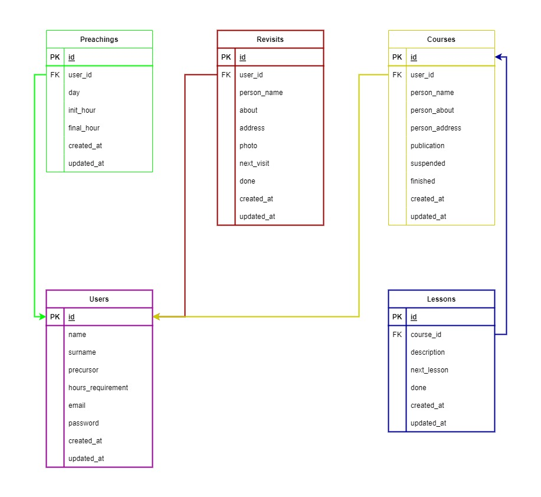

<h1 align="center">JW Reports</h1>

<br>

<p align="center">
    
</p>

<br>

Está aplicación es para **gestionar los informes de predicación, revisitas y cursos de los Testigos de Jehová.** Muchos hermanos 
que saben desarrollar aplicaciones han hecho aplicaciones de este tipo, así que también **me he motivado a hacerlo con el fin 
de ayudar a los hermanos y mejorar mis habilidades** con React Native y usar el servicio de Supabase. Cabe aclarar que está **no 
es una aplicación oficial de Watch Tower Bible and Tract Society of Pennsylvania.**

También he decido dejar el **código al público** para que se vea el funcionamiento de la aplicación y más hermanos que tengan los 
conocimientos debidos puedan, si ellos lo quieren, **hacer su propia implementación.**

Este documento explica las tecnologías utilizadas, el entorno de desarrollo, arquitectura, la base de datos, cómo crear su implementación propia, el testing, etc.

## 1) Tecnologías

### 1.1) React Native
Es un **marco de desarrollo de aplicaciones móviles** que permite a los desarrolladores crear aplicaciones para iOS y Android 
utilizando la misma **base de código en JavaScript y React.**

**Utiliza una arquitectura de componentes,** lo que significa que las aplicaciones se construyen a partir de **componentes 
reutilizables** que se pueden combinar para crear interfaces de usuario complejas. Estos componentes se pueden personalizar con CSS 
y JavaScript, lo que permite a los desarrolladores **crear aplicaciones móviles personalizadas y únicas.**

Proporciona una **experiencia de desarrollo más rápida** al permitir a los desarrolladores **escribir una vez y ejecutar en 
múltiples plataformas.** Además, utiliza un **enfoque de renderizado nativo,** lo que significa que las aplicaciones se ejecutan 
de manera más eficiente y tienen un mejor rendimiento que las aplicaciones web empaquetadas en una vista web dentro de 
una aplicación nativa.

### 1.2) Typescript
Lenguaje de programación de **código abierto** desarrollado por Microsoft que **amplía la sintaxis de JavaScript** con la adición de 
tipos estáticos opcionales. Se puede considerar como una **capa de abstracción sobre JavaScript** que proporciona una mayor 
seguridad y escalabilidad al código.

Los desarrolladores pueden **especificar tipos de datos para variables, funciones y otros elementos del código,** lo que permite 
**detectar errores de manera más temprana** durante la fase de desarrollo. Además, TypeScript permite a los desarrolladores 
**aprovechar las características avanzadas de ECMAScript, como clases, interfaces y decoradores,** mientras proporciona una 
compatibilidad con versiones anteriores de JavaScript.

### 1.3) Supabase
Es una **alternativa de Firebase de código abierto.** Una **plataforma de bases de datos en la nube** que combina la
simplicidad y la accesibilidad de una **herramienta de gestión de bases de datos** no relacionales con la potencia y
la escalabilidad de una base de datos relacional.

Supabase es una opción popular para desarrolladores y empresas que buscan una solución de bases de datos en la nube para
sus aplicaciones y proyectos.

### 1.4) OneSignal
Es una **plataforma de mensajería y automatización de notificaciones push** para sitios web y aplicaciones móviles. Permite a
los desarrolladores y propietarios de sitios web **enviar notificaciones push personalizadas y automatizadas** a los usuarios en
tiempo real.

### 1.5) Jest
Es la **herramienta de Test más popular** y recomendada para React. Es creado por Facebook. Jest no es solo una biblioteca, es
un marco de prueba. Significa que **viene con una biblioteca de afirmaciones, un corredor de pruebas y soporte** para cosas.
Como ha sido diseñado específicamente para probar las aplicaciones React, también se puede utilizar en otros marcos de JavaScript.

### 1.6) React Native Testing Library
Nos ofrece un nuevo enfoque a más alto nivel sobre los tests, válido tanto para **unitarios como para integración** y al combinarlos
podemos conseguir una cobertura de tests con la que podemos confirmar que estamos desarrollando sobre seguro en proyectos de
cualquier tamaño.

### 1.7) Enlaces
 * [React Native](https://reactnative.dev)  
 * [TypeScript](https://www.typescriptlang.org)  
 * [Supabase](https://supabase.com)  
 * [OneSignal](https://onesignal.com)
 * [Jest](https://jestjs.io)
 * [React Native Testing Library](https://callstack.github.io/react-native-testing-library)

<br>

## 2) Entorno de desarrollo

Para montar el entorno de desarrollo y correr la aplicación se necesitan los siguientes programas:

### 2.1) Node.js
Es un **entorno en tiempo de ejecución multiplataforma para la capa del servidor** (en el lado del servidor) basado en 
JavaScript. Controlado por eventos, diseñado para crear aplicaciones escalables, permitiéndote establecer y gestionar 
múltiples conexiones al mismo tiempo. Gracias a esta característica, no tienes que preocuparte con el bloqueo de procesos, 
pues no hay bloqueos.

Node.js está **basado en el motor V8 de Google**, uno de los intérpretes de lenguaje de programación que existen. Este 
motor se encarga de compilar el código JavaScript en código de máquina, un código de nivel más bajo que no hace falta 
que sea interpretado por el navegador.

### 2.2) Yarn (opcional)
Es un **gestor dependencias de JavaScript**, que está enfocado en la velocidad y la seguridad, y a diferencia de otros gestores
como NPM, YARN es muy rápido y muy fácil de usar.

Además, **devuelve un feedback al usuario bastante amigable**, lo que hace que este sienta que realmente la propia herramienta
vela porque aprendamos a usarla y porque tengamos siempre la mejor y más clara ayuda posible.

### 2.3) Android Studio
Cuando hablamos de Android Studio, nos referimos a un **entorno de desarrollo especializado**. Evidentemente, hablamos de todo
lo que tenga que ver con el desarrollo de herramientas y aplicaciones para sistemas operativos Android.

Permite una **flexibilidad en cuanto al desarrollo de características y funciones** que puede tener una herramienta o app de
dicho sistema.

Este entorno sirve para que las **aplicaciones que se esten desarrollando sean mucho más eficiente y autosuficientes**. Esto
permite, incluso, tener compatibilidades con otros sistemas o plataformas.

### 2.4) Flipper
Flipper es una **plataforma para depurar aplicaciones iOS, Android y React Native**. Puede visualizar, inspeccionar y controlar
sus aplicaciones desde una sencilla interfaz de escritorio. Puede usar Flipper tal cual o extiéndalo usando plugin API.

### 2.5) Enlaces
 * [Node.js](https://nodejs.org)
 * [Yarn](https://yarnpkg.com)
 * [Android Studio](https://developer.android.com/studio)
 * [Flipper](https://fbflipper.com)

<br>

## 3) Arquitectura
Con **arquitectura** me refiero a las **aplicaciones que en conjunto permiten el correcto funcionamiento de JW Reports.** 
En total podemos **identificar 4 aplicaciones** para este proyecto: Aplicación Movil, Proyecto de Supabase, Sitio Web de
verificación de correos y Servidor de Notificaciones. Cada una con un proposito. 

Al final de está sección encontrará unos enlaces para ver el código del server y sitio web. Aquí una pequeña explicación
del proposito de cada uno de ellos:

### 3.1) Aplicación Movil
Es la aplicación con la que al final los usuarios **van a interactuar más y es la que tiene el foco principal de desarrollo.** 
Las otras aplicaciones y servicios son para **complementar funcionalidades de la aplicación móvil,** como la verificación de
correos y envio de notificaciones.

### 3.2) Proyecto de Supabase
Es uno de las partes más importantes del proyecto. Supabase es una **alternativa directa a Firebase,** solo que Supabase usa
Postgres como base de datos. Nos **ofrece muchas herramientas** como autenticación, almacenamiento de archivos, gestión de bases
de datos, etc.

### 3.3) Sitio Web de verificación de correos
Es el sitio web de **verificación de correos y procesos relacionados con la autenticación** de usuarios, como el cambio de
contraseñas solicitado por correo.

### 3.4) Servidor de Notificaciones 
Es el **servidor de notificaciones** que permite **enviar recordatorios a los usuarios de la aplicación.** Hace una verificación
de los datos y envia la notificación al usuario. Para esto se realiza una **petición HTTP que debe ser válidada.** Mediante un 
cron que ofrecen algunos servicios en la nube se realiza la petición para enviar las notificaciones.

### 3.5) Enlaces
 * [Sitio Web](https://nodejs.org)
 * [Server](https://yarnpkg.com)

<br>

## 4) Base de datos
Como se menciono anteriormente, Supabase usa **Postgres** como base de datos. Al analizar los requerimientos de este proyecto
se obtiene el siguiente esquema de base de datos:

<br>

<p align="center">
    
</p>

<br>

Como habrá notado hay 5 tablas: ```courses```, ```lessons```, ```preachings```, ```revisits``` y ```users``` que son las
necesarias para el correcto funcionamiento del proyecto.

Algo que **aclarar** es que la tabla de ```users``` no existe como tal, solo es una **representación de los campos que componen
un usuario,** se usa la tabla de ```users``` de la autenticación de Supabase, por ello no es necesario crearla.

## 5) Implementación propia
En está sección se explicará cómo crear su propia implementación de la aplicación. Esto para los usuarios que deseen tener
sus datos en su proyecto de Supabase o para aprender más de este servicio.

### 5.1) Proyecto de Supabase
Lo primero es crear un proyecto de Supabase, para ello debes tener una cuenta en su sitio oficial, puedes acceder [aquí](https://supabase.com). Cuando ya tengas la cuenta vas a crear un nuevo proyecto y llenas los campos que se te pidan. Ahora apareceras
en el Dashboard de administración de tu proyecto.

### 5.2) Proveedor de autenticación
Estando en tu proyecto de Supabase ve a la pestaña de Authentication y luego en configuración selecciona providers. Te saldrá
una lista de proveedores de authenticación (Email, Google, Facebook, Twitter, Slack, Github, etc). Para este caso habilita
el proveedor de Email e inhabilita el resto de funciones de este proveedor (más adelante habilitaremos algunas).

### 5.3) Base de datos
Lo siguiente será crear las tablas que conforman la base de datos, para eso ve a la pestaña de Database de tu proyecto y selecciona
Tables, asegurate de que que el schema seleccionado sea public. Te dejo unas tablas con los tipos de datos y configuraciones de
cada tabla:

<table>
    <thead>
        <th colspan="5">Courses</th>
    </thead>
    <tbody>
        <tr>
            <td>Campo</td>
            <td>Tipo</td>
            <td>Clave</td>
            <td>Requerido</td>
            <td>Valor por defecto</td>
        </tr>
        <tr>
            <td>id</td>
            <td>UUID</td>
            <td>Primary Key</td>
            <td>No</td>
            <td>uuid_generate_v4()</td>
        </tr>
        <tr>
            <td>user_id</td>
            <td>UUID</td>
            <td>Foreign Key (users table of Supabase)</td>
            <td>Si</td>
            <td>No posee</td>
        </tr>
        <tr>
            <td>person_name</td>
            <td>VARCHAR</td>
            <td>No</td>
            <td>Si</td>
            <td>No posee</td>
        </tr>
        <tr>
            <td>person_about</td>
            <td>TEXT</td>
            <td>No</td>
            <td>Si</td>
            <td>No posee</td>
        </tr>
        <tr>
            <td>person_address</td>
            <td>TEXT</td>
            <td>No</td>
            <td>Si</td>
            <td>No posee</td>
        </tr>
        <tr>
            <td>publication</td>
            <td>VARCHAR</td>
            <td>No</td>
            <td>Si</td>
            <td>No posee</td>
        </tr>
        <tr>
            <td>suspended</td>
            <td>BOOL</td>
            <td>No</td>
            <td>No</td>
            <td>false</td>
        </tr>
        <tr>
            <td>finished</td>
            <td>BOOL</td>
            <td>No</td>
            <td>No</td>
            <td>false</td>
        </tr>
        <tr>
            <td>created_at</td>
            <td>TIMESTAMP</td>
            <td>No</td>
            <td>No</td>
            <td>now()</td>
        </tr>
        <tr>
            <td>updated_at</td>
            <td>TIMESTAMP</td>
            <td>No</td>
            <td>No</td>
            <td>now()</td>
        </tr>
    </tbody>
</table>

<br>

<table>
    <thead>
        <th colspan="5">Lessons</th>
    </thead>
    <tbody>
        <tr>
            <td>Campo</td>
            <td>Tipo</td>
            <td>Clave</td>
            <td>Requerido</td>
            <td>Valor por defecto</td>
        </tr>
        <tr>
            <td>id</td>
            <td>UUID</td>
            <td>Primary Key</td>
            <td>No</td>
            <td>uuid_generate_v4()</td>
        </tr>
        <tr>
            <td>course_id</td>
            <td>UUID</td>
            <td>Foreign Key (id of courses table)</td>
            <td>Si</td>
            <td>No posee</td>
        </tr>
        <tr>
            <td>description</td>
            <td>TEXT</td>
            <td>No</td>
            <td>Si</td>
            <td>No posee</td>
        </tr>
        <tr>
            <td>next_lesson</td>
            <td>TIMESTAMP</td>
            <td>No</td>
            <td>No</td>
            <td>now()</td>
        </tr>
        <tr>
            <td>done</td>
            <td>BOOL</td>
            <td>No</td>
            <td>No</td>
            <td>false</td>
        </tr>
        <tr>
            <td>created_at</td>
            <td>TIMESTAMP</td>
            <td>No</td>
            <td>No</td>
            <td>now()</td>
        </tr>
        <tr>
            <td>updated_at</td>
            <td>TIMESTAMP</td>
            <td>No</td>
            <td>No</td>
            <td>now()</td>
        </tr>
    </tbody>
</table>

<br>

<table>
    <thead>
        <th colspan="5">Preachings</th>
    </thead>
    <tbody>
        <tr>
            <td>Campo</td>
            <td>Tipo</td>
            <td>Clave</td>
            <td>Requerido</td>
            <td>Valor por defecto</td>
        </tr>
        <tr>
            <td>id</td>
            <td>UUID</td>
            <td>Primary Key</td>
            <td>No</td>
            <td>uuid_generate_v4()</td>
        </tr>
        <tr>
            <td>user_id</td>
            <td>UUID</td>
            <td>Foreign Key (users table of Supabase)</td>
            <td>Si</td>
            <td>No posee</td>
        </tr>
        <tr>
            <td>day</td>
            <td>TIMESTAMP</td>
            <td>No</td>
            <td>No</td>
            <td>now()</td>
        </tr>
        <tr>
            <td>init_hour</td>
            <td>TIMESTAMP</td>
            <td>No</td>
            <td>Si</td>
            <td>No posee</td>
        </tr>
        <tr>
            <td>final_hour</td>
            <td>TIMESTAMP</td>
            <td>No</td>
            <td>Si</td>
            <td>No posee</td>
        </tr>
        <tr>
            <td>publications</td>
            <td>INT2</td>
            <td>No</td>
            <td>No</td>
            <td>0</td>
        </tr>
        <tr>
            <td>videos</td>
            <td>INT2</td>
            <td>No</td>
            <td>No</td>
            <td>0</td>
        </tr>
        <tr>
            <td>revists</td>
            <td>INT2</td>
            <td>No</td>
            <td>No</td>
            <td>0</td>
        </tr>
        <tr>
            <td>created_at</td>
            <td>TIMESTAMP</td>
            <td>No</td>
            <td>No</td>
            <td>now()</td>
        </tr>
        <tr>
            <td>updated_at</td>
            <td>TIMESTAMP</td>
            <td>No</td>
            <td>No</td>
            <td>now()</td>
        </tr>
    </tbody>
</table>

<br>

<table>
    <thead>
        <th colspan="5">Revisits</th>
    </thead>
    <tbody>
        <tr>
            <td>Campo</td>
            <td>Tipo</td>
            <td>Clave</td>
            <td>Requerido</td>
            <td>Valor por defecto</td>
        </tr>
        <tr>
            <td>id</td>
            <td>UUID</td>
            <td>Primary Key</td>
            <td>No</td>
            <td>uuid_generate_v4()</td>
        </tr>
        <tr>
            <td>user_id</td>
            <td>UUID</td>
            <td>Foreign Key (users table of Supabase)</td>
            <td>Si</td>
            <td>No posee</td>
        </tr>
        <tr>
            <td>person_name</td>
            <td>VARCHAR</td>
            <td>No</td>
            <td>Si</td>
            <td>No posee</td>
        </tr>
        <tr>
            <td>about</td>
            <td>TEXT</td>
            <td>No</td>
            <td>Si</td>
            <td>No posee</td>
        </tr>
        <tr>
            <td>address</td>
            <td>TEXT</td>
            <td>No</td>
            <td>Si</td>
            <td>No posee</td>
        </tr>
        <tr>
            <td>photo</td>
            <td>VARCHAR</td>
            <td>No</td>
            <td>No</td>
            <td>null</td>
        </tr>
        <tr>
            <td>next_visit</td>
            <td>TIMESTAMP</td>
            <td>No</td>
            <td>No</td>
            <td>now()</td>
        </tr>
        <tr>
            <td>done</td>
            <td>BOOL</td>
            <td>No</td>
            <td>No</td>
            <td>false</td>
        </tr>
        <tr>
            <td>created_at</td>
            <td>TIMESTAMP</td>
            <td>No</td>
            <td>No</td>
            <td>now()</td>
        </tr>
        <tr>
            <td>updated_at</td>
            <td>TIMESTAMP</td>
            <td>No</td>
            <td>No</td>
            <td>now()</td>
        </tr>
    </tbody>
</table>